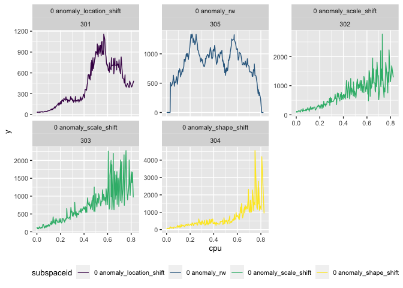

<!-- README.md is generated from README.Rmd. Please edit that file -->

# outfit

<!-- badges: start -->

[](https://www.repostatus.org/#wip)
[](https://travis-ci.org/pridiltal/outfit)
[](https://www.gnu.org/licenses/gpl-3.0.en.html)
[](https://cran.r-project.org/web/packages/outfit/index.html)
[](http://cran.rstudio.com/web/packages/outfit/index.html)

[](/commits/master)
<!-- badges: end -->

The goal of outfit is to detect outliers in multivariate functional data

## Installation

You can install the released version of outfit from
[CRAN](https://CRAN.R-project.org) with:

``` r
install.packages("outfit")
```

And the development version from [GitHub](https://github.com/) with:

``` r
# install.packages("devtools")
devtools::install_github("pridiltal/outfit")
```

## Explore `utilization_curves` dataset

``` r
library(outfit)
library(tidyverse)
## basic example code
head(utilization_curves)
#>   basisid id         cpu   y             subspaceid
#> 1       1  1 0.001007227 129 1 constant_scale_shape
#> 2       1  1 0.002784417 131 1 constant_scale_shape
#> 3       1  1 0.003465359 105 1 constant_scale_shape
#> 4       1  1 0.005992975  96 1 constant_scale_shape
#> 5       1  1 0.010085913  97 1 constant_scale_shape
#> 6       1  1 0.013900140 113 1 constant_scale_shape

p <- utilization_curves %>%
  ggplot(aes(x = cpu, y = y, group = id, color= subspaceid)) +
  geom_line() +
  facet_wrap(~subspaceid, scales = "free_y", nrow = 2) +
  theme(text = element_text(size=10), legend.position = "bottom" )+
  scale_color_viridis_d()

print(p)
```


``` r

frq <- utilization_curves %>%
  dplyr::select(id, subspaceid) %>%
  unique() %>% 
  group_by(subspaceid) %>% 
  tally()

print(frq)
#> # A tibble: 8 x 2
#>   subspaceid                   n
#>   <chr>                    <int>
#> 1 0 anomaly_location_shift     1
#> 2 0 anomaly_rw                 1
#> 3 0 anomaly_scale_shift        2
#> 4 0 anomaly_shape_shift        1
#> 5 1 constant_scale_shape      75
#> 6 2 constant_scale_shape      75
#> 7 3 constant_scale_shape      75
#> 8 4 constant_scale_shape      75
```

## Outlying Series

``` r
types <- unique(utilization_curves$subspaceid)

out_data <- utilization_curves %>%
  filter(subspaceid %in% c("0 anomaly_location_shift", "0 anomaly_scale_shift", "0 anomaly_shape_shift", "0 anomaly_rw" ))

p <- out_data %>%
  ggplot(aes(x = cpu, y = y, group = subspaceid, color= subspaceid)) +
  geom_line() +
  facet_wrap(vars(subspaceid, id), scales = "free_y", nrow = 2) +
  theme(text = element_text(size=10), legend.position = "bottom" )+
  scale_color_viridis_d()
p
```



## Extract features

``` r
library(GGally)
data <- utilization_curves %>%
  dplyr::select(id, y) 
features <- outfit::get_features(data = data, df_mu = 10)

d <- utilization_curves %>%
  dplyr::select(id, subspaceid) %>%
  unique()

features <- dplyr::full_join(features, d, by = "id" )


p <- GGally::ggparcoord(features,
  columns = 2: (ncol(features)-1), groupColumn = ncol(features), order = "Outlying",
  showPoints = TRUE,
  alphaLines = 0.4, scale = "uniminmax"
) +
  #scale_color_brewer(palette = "RdYlGn") +
  scale_color_viridis_d() +
  theme(legend.position = "bottom") +
  xlab("Features") +
  ylab("Values")
print(p)
```


``` r
out <- stray::find_HDoutliers(features[, 2:(ncol(features)-1)], alpha = 0.01
)

utilization_curves %>%
  filter(id %in%(out$outliers)) %>%
  select(id, subspaceid) %>%
  unique()
#>    id   subspaceid
#> 1 305 0 anomaly_rw

score <- data.frame(id = 1:nrow(features), score = out$out_scores)

d <- utilization_curves %>%
  dplyr::select(id, subspaceid) %>%
  unique()

data_score <- full_join(d,score, by = "id")
data_score %>% arrange(desc(score)) %>% head(10)
#>     id               subspaceid     score
#> 1  305             0 anomaly_rw 1.2254934
#> 2   12   1 constant_scale_shape 0.6530229
#> 3  273   3 constant_scale_shape 0.6221775
#> 4  276   4 constant_scale_shape 0.5943441
#> 5  295   4 constant_scale_shape 0.5872774
#> 6  301 0 anomaly_location_shift 0.5428492
#> 7  263   3 constant_scale_shape 0.4285281
#> 8  185   4 constant_scale_shape 0.3360587
#> 9  245   2 constant_scale_shape 0.3245990
#> 10 230   2 constant_scale_shape 0.3184717
```
